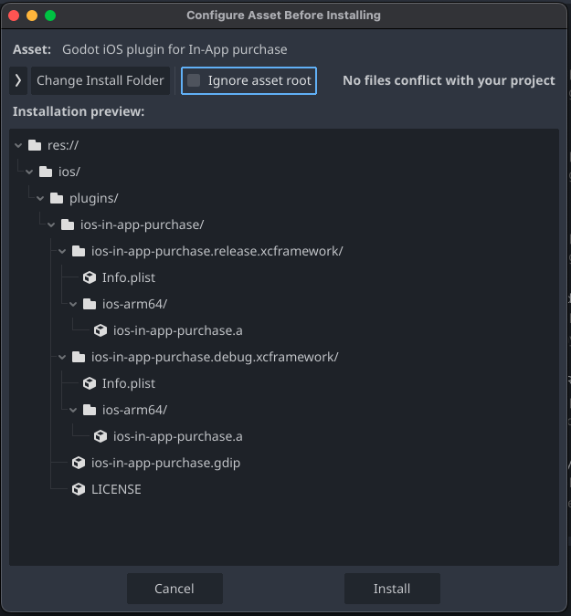
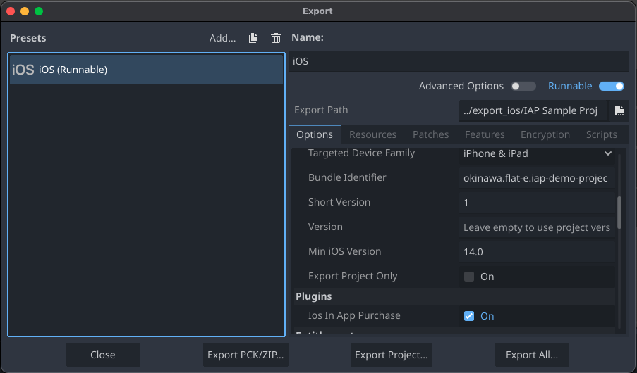

# Godot iOS plugin for In-App purchase

This is a Godot iOS plugin for In-App purchase.
This plugin uses Storekit in Swift.

## Contents

- Features
- Install
- Build
- How to use
- Bug report
- Acknowledgements
- License

## Features

- Request product list
- Request purchase a product
- Request current entitlements (purchased item lists)
- Receive actions outside of the app and send them as purchase responses

## Install

The following steps download the plugin from the Godot editor. 

- Open AssetLib and search ```Godot iOS plugin for In-App purchase```
- Select the plugin and click ```Download```
    -  In ```Configure Asset Before Installing``` dialog, set ```Ignore asset root``` checkbox to off to include ```ios``` directory (image 1)
- Open Export dialog and create an iOS export (image 2)
    - set ```Bundle Identifier``` for your app
    - ensure that ```Ios In App Purchase``` checkbox in ```Plugins``` is on

image 1



image 2




## Build

The build steps are confirmed in the following environments.

- Godot: 4.4.1
- macOS: Sequoia 15.4.1
- Xcode: 16.3
- scons: v4.8.1
- python: 3.12
- iPhone: iPhone SE, iOS 18.3.2

There are build steps.

- Generate godot header files
- Generate plugin's static library
- Copy it into your Godot project

### Generate godot header files

```bash
% cd godot_ios_plugin_iap
# Clean godot directory
% script/build.sh -g
# Download specified godot version
% script/build.sh -G 4.4
# Generate godot header. In this case, it waits 600 seconds, assuming that the build process would be finished 
% script/build.sh -Ht 600
```

### Generate plugin's static library and copy it into your Godot project

```bash
% ./generate_static_library.sh
```

### Copy it into your Godot project

run ```copy_plugin.sh``` to copy files of the plugin.

```bash
% ./copy_plugin.sh ../your_godot_project
```

## How to use

This plugin singleton's ```request``` method calls the methods implemented in StoreKit.
```request``` takes two arguments, a name of request and a Dictionary that contains key and values used in the request. 
```request``` method returns 0 if the request is succeeded or 1 if failed. 

All response from the plugin singleton is returned as a signal named ```response```. 
It is recommended that connecting to ```response``` signal before calling ```request``` method not to miss the responses.

### Request and response

This is a list of request.

- startUpdateTask
    - starts a task to receive callbacks from [Transaction.updates](https://developer.apple.com/documentation/storekit/transaction/updates)
    - returns purchase response when purchasing is done outside of the app
- products
	- gets a list of products.
	- requires "productIDs" which value is an array of product id registered in app store or StoreKit configuration
	- returns the result of [Product.products()](https://developer.apple.com/documentation/storekit/product/products(for:))
- purchase
	- purchases an item specified by its product id
	- requires "productID"
	- returns the result of [Product.purchase()](https://developer.apple.com/documentation/storekit/product/purchase(options:))
	- the result includes [jwsRepresentation](https://developer.apple.com/documentation/storekit/verificationresult/jwsrepresentation-21vgo)
- purchasedProducts
	- gets a list of products the user purchased
	- no argument required
	- returns a list of products the user purchased. a product with revocationDate is not included in the list
- transactionCurrentEntitlements
	- returns a result of [Transaction.currentEntitlements](https://developer.apple.com/documentation/storekit/transaction/currententitlements)
	- no argument required
	- the product item includes [jwsRepresentation](https://developer.apple.com/documentation/storekit/verificationresult/jwsrepresentation-21vgo) if the product is verified
- transactionAll
	- returns a result of [Transaction.all](https://developer.apple.com/documentation/storekit/transaction/all)
	- no argument required
	- the product item includes [jwsRepresentation](https://developer.apple.com/documentation/storekit/verificationresult/jwsrepresentation-21vgo) if the product is verified
- proceedUnfinishedTransactions
	- proceeds unfinished transactions
	- no argument required
	- returns results as purchase response
- appStoreSync
	- call [AppStore.sync()](https://developer.apple.com/documentation/storekit/appstore/sync()) to restore transaction information ```when a user suspects the app isn’t showing all the transactions.```
	- Calling this method causes that Apple ID Login popup shows
	- no argument required

### Sample project

The following code is from the sample project.

iap-sample-project/main.gd
```
extends Control

var ItemButton = preload("res://item_button.tscn")
var ItemLabel = preload("res://item_label.tscn")

@onready var container_purchase_items = $VBoxContainer/PurchaseItems
@onready var container_purchased_items = $VBoxContainer/PurchasedItems

var singleton

func _ready() -> void:
	print("_ready")
	if !Engine.has_singleton("IOSInAppPurchase"):
		print("IOSInAppPurchase is not found")
		return

	print("IOSInAppPurchase is found")

	# get the singleton
	singleton = Engine.get_singleton("IOSInAppPurchase")

	# connect response signal with the callback method.
	# It should be done before calling startUpdateTask to receive
	# purchase responses occured outside of the app.
	singleton.response.connect(_receive_response)

	# start update task to receive update outside of the app
	print("startUpdateTask:%s" % singleton.request("startUpdateTask", {}))

	call_products()

	print("transactionCurrentEntitlements:%s" % 
		singleton.request("transactionCurrentEntitlements", {}))

func call_products() -> void:
	# get product list
	var product_data = {
		"productIDs":[
			"dummy_consumable001", 
			"dummy_non_consumable001",
			"okinawa.flat_e.iap_demo_project.sg1.premium",
			"okinawa.flat_e.iap_demo_project.sg1.standard",
			"okinawa.flat_e.iap_demo_project.non_auto_renewal_subscription001"
			]
		}
	print(singleton.request("products", product_data))

func _receive_response(response_name:String, data:Dictionary) -> void:
	# receive response signals from the plugin.
	print("response:%s data:%s" % [response_name, data])
	match response_name:
		"products":
			if data["result"] == "success":
				call_deferred("update_product_list", data)
			else:
				# retry request
				await get_tree().create_timer(5.0).timeout
				call_deferred("call_products")
		"purchase":
			if data["result"] == "success":
				call_deferred("item_purchased", data)
		"purchasedProducts":
			call_deferred("handle_purchased_products", data)
		"transactionCurrentEntitlements":
			call_deferred("handle_transaction_current_entitlements", data)

func item_purchased(data) -> void:
	# When purchasing a consumable item, 
	# increasing number of item in your app may be needed

	# response of purchase is like:
	# {
	#     "request": "purchase",
	#     "result": "success",
	#     "productID": "xxxxxxxx",
	#     "purchasedQuantity": "1"
	#     "productType": "Consumable",
	#     "json": "{ ... }",
	#     "jwsRepresentation": "...",
	#     "revocationDate": "",  // revoked purchase has "revocationDate"
	# }

	print("item_purchased:%s" % data)
	print("transactionCurrentEntitlements:%s" % 
		singleton.request("transactionCurrentEntitlements", {}))

func update_product_list(data) -> void:
	for child in container_purchase_items.get_children():
		container_purchase_items.remove_child(child)

	var products = data["products"]
	for product in products:
		var button = ItemButton.instantiate()
		container_purchase_items.add_child(button)
		button.text = "ID:%s ITEM:%s PRICE:%s TYPE:%s" % [
			product["id"], 
			product["displayName"], 
			product["displayPrice"],
			product["type"]
		]
		button.pressed.connect(purchase_item.bind(product["id"]))

func purchase_item(product_id) -> void:
	print("purchase_item:%s" % product_id)
	# specify "productID" to purchase
	singleton.request("purchase", {"productID":product_id})

func handle_purchased_products(data) -> void:
	for child in container_purchased_items.get_children():
		container_purchased_items.remove_child(child)
	# response of purchasedProducts includes only product id
	var product_ids = data["productIDs"]
	for product_id in product_ids:
		var label = ItemLabel.instantiate()
		container_purchased_items.add_child(label)
		label.text = product_id

func handle_transaction_current_entitlements(data) -> void:
	# response of transactionCurrentEntitlements is like:
	# {
	#     "transactions": [
	#         {
	#             "productID": "xxxxxxxx",
	#             "signedDate": "2025-05-23 15:14:13",
	#             "productType": "Non-Renewing Subscription",
	#             "appTransactionID": "704407022484307126",
	#             "id": "2000000902286324",
	#             "purchasedQuantity": "1",
	#             "originalPurchaseDate": "2025-04-21 06:58:55",
	#             "json": "{...}",
	#             "jwsRepresentation": "...",
	#             "isUpgraded": "false",
	#             "purchaseDate": "2025-04-21 06:58:55",
	#             "originalID": "2000000902286324",
	#             "ownershipType": "PURCHASED"
	#         }
	#     ],
	#     "result": "success",
	#     "request": "transactionCurrentEntitlements"
	# }

	for child in container_purchased_items.get_children():
		container_purchased_items.remove_child(child)
	var transactions = data["transactions"]
	for transaction in transactions:
		var label = ItemLabel.instantiate()
		container_purchased_items.add_child(label)
		label.text = "PRODUCT_ID:%s EXPIRATION_DATE:%s" % [
			transaction["productID"], 
			transaction["expirationDate"]
		]

func _on_button_purchased_item_pressed() -> void:
	if singleton:
		print(singleton.request("transactionCurrentEntitlements", {}))

func _on_button_transaction_history_pressed() -> void:
	if singleton:
		# transactionAll gets all transaction
		print(singleton.request("transactionAll", {}))

func _on_button_proceed_unfinished_pressed() -> void:
	if singleton:
		# proceedUnfinishedTransactions finishes unfinished transactions
		print(singleton.request("proceedUnfinishedTransactions", {}))

func _on_button_app_store_sync_pressed() -> void:
	if singleton:
		# appStoreSync restores purchase
		print(singleton.request("appStoreSync", {}))
```

## Bug report

Bug report is important. Feel free to leave a report on [issues](https://github.com/hrk4649/godot_ios_plugin_iap/issues).

## Acknowledgements

This plugin is built on the following works.
Thank you [DrMoriarty](https://github.com/DrMoriarty) and [cengiz-pz](https://github.com/cengiz-pz) !

- Godot iOS Plugin template https://github.com/DrMoriarty/godot_ios_plugin_template
- In-app Review Plugin https://github.com/cengiz-pz/godot-ios-inapp-review-plugin
    - godot_ios_plugin_iap
        - script
            - LICENSE

## License

```
MIT License

Copyright (c) 2025 Hiroki Taira

Permission is hereby granted, free of charge, to any person obtaining a copy
of this software and associated documentation files (the "Software"), to deal
in the Software without restriction, including without limitation the rights
to use, copy, modify, merge, publish, distribute, sublicense, and/or sell
copies of the Software, and to permit persons to whom the Software is
furnished to do so, subject to the following conditions:

The above copyright notice and this permission notice shall be included in all
copies or substantial portions of the Software.

THE SOFTWARE IS PROVIDED "AS IS", WITHOUT WARRANTY OF ANY KIND, EXPRESS OR
IMPLIED, INCLUDING BUT NOT LIMITED TO THE WARRANTIES OF MERCHANTABILITY,
FITNESS FOR A PARTICULAR PURPOSE AND NONINFRINGEMENT. IN NO EVENT SHALL THE
AUTHORS OR COPYRIGHT HOLDERS BE LIABLE FOR ANY CLAIM, DAMAGES OR OTHER
LIABILITY, WHETHER IN AN ACTION OF CONTRACT, TORT OR OTHERWISE, ARISING FROM,
OUT OF OR IN CONNECTION WITH THE SOFTWARE OR THE USE OR OTHER DEALINGS IN THE
SOFTWARE.
```